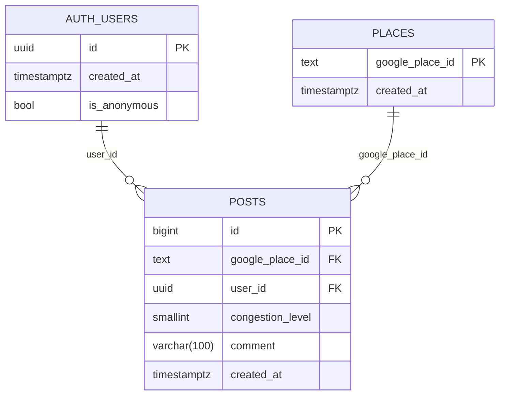

# cocowa

「いまここ」の状況を、今その場にいる人がみんなに教えてあげるWebアプリ。
行く前の不安（混み具合、待ち時間、数量限定商品の残りなど）を、事前に確認できる。

## 解決したいこと
お店に着いてから「思ったより混んでいた」「限定商品が売り切れだった」
とならないよう、今の状況を事前に知りたい。

## 対象エリア
- 最初：丸の内周辺（東京駅の中心から半径500m、仮。あとで調整）
- 将来：山手線沿線に広げる
- エリアの中心と半径は設定値にして、開発中は別の場所でも試せるようにする

## MVP（最初に作る機能）
- 地図サービスでお店を検索して選ぶ（対象エリア内）。最初の投稿時にお店を自動で登録する
- 混み具合を5段階で投稿する
  - ガラガラ / 空いてる / ふつう / 混んでる / 満席・行列
- コメントを必須で書く（5〜100字）
  - 「待ち時間 ○分」「○○ 残りわずか」「売り切れ」などのボタンで入力を補助する
- お店ごとに、1時間以内の投稿を「今の状況」として表示する
  - 「○分前」と表示し、なければ「今の情報はまだありません」と出す
- 匿名で投稿できる（同じユーザー（匿名サインインのID）が同じお店へは30分に1回まで）

## MVPではやらないこと
ログイン、ポイント、通知、写真投稿、位置情報での「今いる」確認

## 将来やりたいこと
- ログイン機能
- 独自ポイント（投稿すると貯まる。使う人が増えたら交換先を検討）
- 位置情報で「今その場にいる人」だけが投稿できる仕組み
- 時間帯ごとの混雑傾向の表示
- 山手線沿線への拡大

## 設計
- PLACESには google_place_id と created_at だけを保存する。店名や座標は保存せず、表示時に Google Places API から取得する。
- GoogleのPlace IDは公式ドキュメント上、保存と再利用が認められている。店名や座標はDBに保存しない。表示用のキャッシュは、Googleの規約で許される範囲を確認してから決める（それまでは使わない）。
- 投稿は常にサーバー側で検証し、対象エリア内の店かどうか、実在の place_id かどうかを確認してから PLACES を作成し、POSTS を登録する。
- 30分制限は、DB側の1つの処理（関数/トリガー）で判定し、同じユーザー・同じお店に対して 30 分以内の投稿が既にある場合は INSERT を拒否する。

## 設計メモ
- 匿名サインインで付いたユーザーIDを、投稿に紐づける（将来のログイン追加でも同じIDを引き継ぐ）
- 1時間より古い投稿も削除せず残す
- POSTS の congestion_level は 1〜5 の CHECK 制約を付ける
- POSTS の comment は 5〜100字の CHECK 制約を付ける（varchar(100)）
- POSTS に「お店＋作成日時」のインデックスを付ける
- PLACES の書き込みはサーバー側だけに限定し、一般ユーザーは読み取りのみ許可する
- POSTS の更新と削除は誰にも許可しない
- 同じユーザー・同じお店への30分制限は、DB側の1つの処理（関数/トリガー）で判定する
- POSTSの読み取りは誰でも可。投稿は、匿名サインインを含むサインイン済みのユーザーが、自分のユーザーIDで行う場合だけ許可する
- 店名や座標は保存せず、表示時に Google Places API から取得する。長期のキャッシュは避け、必要に応じて短期間だけのキャッシュに留める

## 技術構成
- 画面：Next.js
- DB・認証：Supabase（PostgreSQL。匿名サインインから始め、将来ログインに切り替え可能）
- お店の検索：Google Places API（サーバー側から呼び出す。APIキーは .env）
- 公開：Vercel
- 決めたこと：お店は place_id を保存する。店名や座標の保存は最小限に留め、Google から表示時に取得する